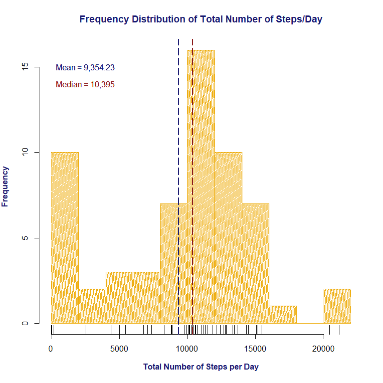
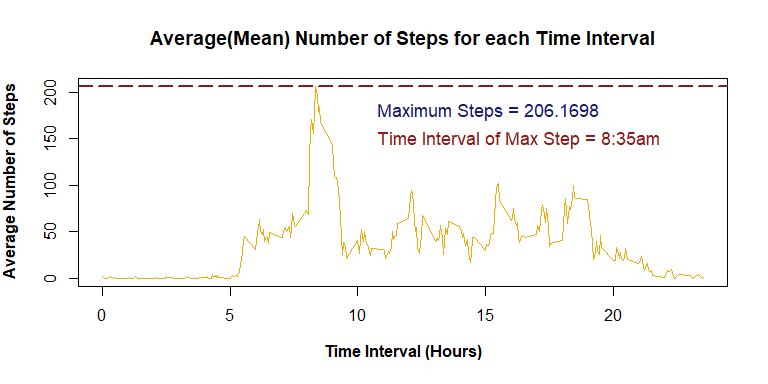
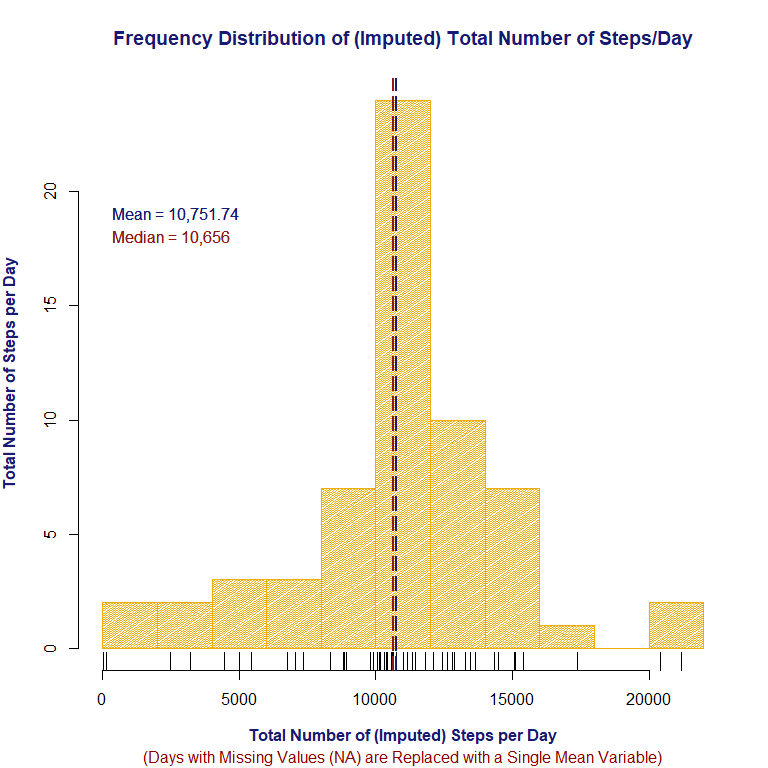
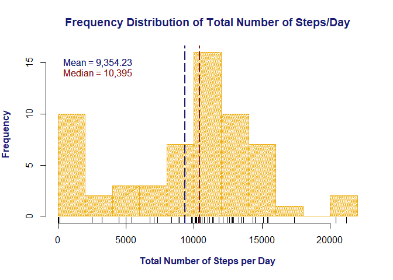
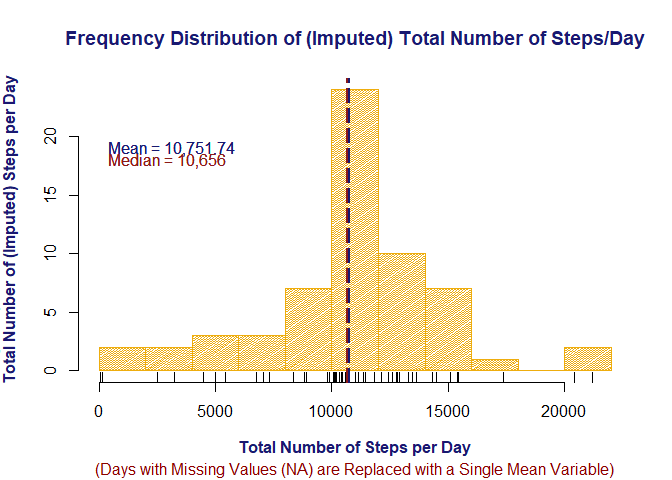
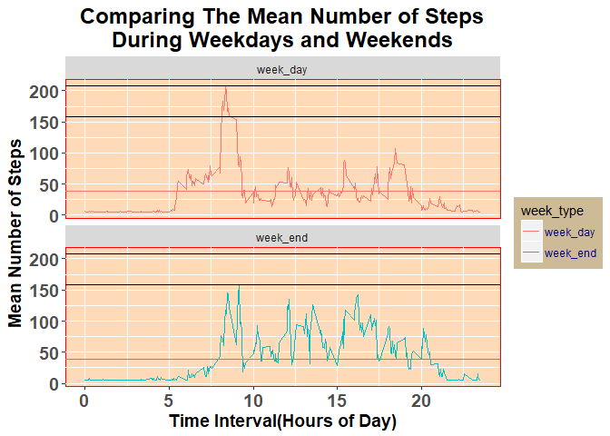

## **Introduction**
The Coursera Course, Reproducible Research, focuses on reporting data analyses in a reproducible manner through the use of a variety of tools and concepts. 

[**Wikipedia**](https://en.wikipedia.org/wiki/Reproducibility#Reproducible_research) defines Reproducible Research succintly by it's definition, "The term reproducible research refers to the idea that the ultimate product of academic research is the paper along with the laboratory notebooks [10] and full computational environment used to produce the results in the paper such as the code, data, etc. that can be used to reproduce the results and create new work based on the research."

Roger Peng, Ph.D, Associate Proffessor of Biostatistics, JHBSPH, said it best in his lecture, [**Reproducible Research**](https://www.coursera.org/learn/reproducible-research/lecture/tVCoy/reproducible-research-concepts-and-ideas-part-1), "So the basic idea is that in science, replication is the most important element of kind of verifying and validating findings that a scientist discover."

This statement is exactly what this Week 2, Peer Assessment Review Project, exemplifies.  The project will introduce the concept of *imputation* and how analyses generated can be largely affected by the presence of missing data, commonly known as *NA Values*.  Concordantly, this project will also continue to hone the skills of *subsetting*, *creating graphs*, *aggregating data* and *working with dates* through using the [**R Programming Studio Suite**](https://www.rstudio.com). 

Alas, Let us begin:

```r
setwd("C:/Users/geo/Desktop/Jeff/Coursera/Reproducible Research/week2/Peer Review Project")
```

## **Loading and Preprocessing the Data**

The Dataset for this assignment can be downloaded from the Course Website at:
[**Activity Monitoring Data**](https://d396qusza40orc.cloudfront.net/repdata%2Fdata%2Factivity.zip)

The Variables included in this dataset are listed below:

- **Steps:** Number of steps taking in a 5-minute interval (missing values are coded as NA)
- **Date:** The date on which the measurement was taken in YYYY-MM-DD format
- **Interval:** Identifier for the 5-minute interval in which measurement was taken

The Dataset is stored in a comma-separated-value, or, (CSV) file and there are a total of 17,568 observations in said dataset.

The libraries neccessary to perform all functions are coded below:


```r
library(dplyr)
library(ggplot2)
library(Hmisc)
```

### **Loading the Data**

```r
fileurl <- "https://d396qusza40orc.cloudfront.net/repdata%2Fdata%2Factivity.zip"
download.file(fileurl, destfile = "./activity.zip")
date_of_download <- date()
print(date_of_download)
```

```
## [1] "Wed Mar 14 13:43:16 2018"
```

```r
unzip('activity.zip')
data <- read.csv("activity.csv", header = TRUE, stringsAsFactors = FALSE)
str(data)
```

```
## 'data.frame':	17568 obs. of  3 variables:
##  $ steps   : int  NA NA NA NA NA NA NA NA NA NA ...
##  $ date    : chr  "2012-10-01" "2012-10-01" "2012-10-01" "2012-10-01" ...
##  $ interval: int  0 5 10 15 20 25 30 35 40 45 ...
```

```r
summary(data)
```

```
##      steps            date              interval     
##  Min.   :  0.00   Length:17568       Min.   :   0.0  
##  1st Qu.:  0.00   Class :character   1st Qu.: 588.8  
##  Median :  0.00   Mode  :character   Median :1177.5  
##  Mean   : 37.38                      Mean   :1177.5  
##  3rd Qu.: 12.00                      3rd Qu.:1766.2  
##  Max.   :806.00                      Max.   :2355.0  
##  NA's   :2304
```

```r
head(data)
```

```
##   steps       date interval
## 1    NA 2012-10-01        0
## 2    NA 2012-10-01        5
## 3    NA 2012-10-01       10
## 4    NA 2012-10-01       15
## 5    NA 2012-10-01       20
## 6    NA 2012-10-01       25
```

###**Process/transform the data (if necessary) into a format suitable for your analysis**
Through examining the summary of the data above, we see that observations were recorded in *5 minute* increments on a *24 hour* period for *61* days.
I transformed the data by adding multiple column variables to represent months(**months**), days of the week(**week_day**), and days of the year(**year_day**); all of which show at what time the data was recorded.  
The observations were recorded from October 1, 2012 through November 30, 2012.  The Data Frame shows them as days of the year, i.e., the 274th to the 334th day in the Calendar Year.


```r
data$date <- as.Date(data$date)
data$months <- month.name[as.POSIXlt(data$date)$mon +1]
data$week_day <- as.POSIXlt(data$date)$wday +1
data$week_day <- factor(data$week_day
                , labels=c("Sunday","Monday"
                , "Tuesday", "Wednesday", "Thursday"
        , "Friday", "Saturday"))
data$year_day <- as.POSIXlt(data$date)$yday
head(data)
```

```
##   steps       date interval  months week_day year_day
## 1    NA 2012-10-01        0 October   Monday      274
## 2    NA 2012-10-01        5 October   Monday      274
## 3    NA 2012-10-01       10 October   Monday      274
## 4    NA 2012-10-01       15 October   Monday      274
## 5    NA 2012-10-01       20 October   Monday      274
## 6    NA 2012-10-01       25 October   Monday      274
```
After manipulating the data above, we can now answer:

#**Question 1**:
## ***What is the mean total number of steps taken per day?***
###Question 1a: *"Calculate the total number of steps taken per day"*
In order to answer this question, I first had to take the sum of the number of steps that were taken each of the 61 days of the observational period:


```r
library(dplyr)
by_year_day <- group_by(data, year_day)
sum_by_year_day <- summarise(by_year_day, sum(steps, na.rm = TRUE))
colnames(sum_by_year_day) <- c("number_of_day", "sum_of_steps")
head(sum_by_year_day)
```

```
## # A tibble: 6 x 2
##   number_of_day sum_of_steps
##           <int>        <int>
## 1           274            0
## 2           275          126
## 3           276        11352
## 4           277        12116
## 5           278        13294
## 6           279        15420
```
###Question 1b: *"Make a histogram of the total number of steps taken each day"*
I am representing the results by creating a histogram using the "base plotting system" in R.  This will show the **'frequency distribution'** of the total number of steps that were taken each day.  

```r
hist_1 <- hist(sum_by_year_day$sum_of_steps
     , col = "darkgoldenrod2"
     , breaks = 10
     , angle = 35
     , density = 55
     , xlab = expression(bold("Total Number of Steps per Day"))
     , ylab = expression(bold("Frequency"))
     , main = expression(bold("Frequency Distribution of Total Number of Steps/Day")
                         , hjust = 0.5)
     , col.main = "midnightblue"
     , col.lab = "midnightblue"
     , cex = 2.0)
rug(sum_by_year_day$sum_of_steps)
abline(v = mean(sum_by_year_day$sum_of_steps
                , na.rm = TRUE)
       , col = "midnightblue"
       , lwd = 2
       , lty = 5)
abline(v = median(sum_by_year_day$sum_of_steps
                  , na.rm = TRUE)
       , col = "firebrick4"
       , lwd = 2
       , lty = 5)
text(c(15,15)
     , pos = 4
     , "Mean = 9,354.23"
     , cex = 1
     , col = "midnightblue")
text(c(14, 14)
     , pos = 4
     , "Median = 10,395"
     , cex = 1
     , col = "firebrick4")
```



***Note:*** 
I also added two vertical 'ablines' to showcase the **mean** and **median** that were calculated **below**.

###Question 1c: *"Calculate and report the mean and median of the total number of steps taken per day"*
Then, to obtain the mean, I had to take the **sum** of the total number of steps taken daily for each of the days in the observation period and then **divide** it by the total number of days(61) in the observational period.

##### ***Of Particular Note:***
**There are several observations with *"0"*, or NA values.  This indicates that there were no observations recorded on that particular day, or, in fact the data was missing.  Upon answering subsequent questions in the project, you will be able to see how the value of *"0"* was assigned to the days in question.  I will include these *"0"* value days in the analysis for now.**


```r
mean_steps_per_day <- mean(sum_by_year_day$sum_of_steps, na.rm = TRUE)
print(mean_steps_per_day)
```

```
## [1] 9354.23
```

To obtain the median, I had to take the **sum** of the total number of steps taken daily for each of the days in the observation period and find the **midpoint** for each of the observations such that there is an equal probability of falling above or below it:

```r
median_steps_per_day <- median(sum_by_year_day$sum_of_steps, na.rm = TRUE)
print(median_steps_per_day)
```

```
## [1] 10395
```
#**Question 2:**
##***What is the average daily activity pattern?***
In order to succinctly answer this question, I had to **group** the *number of steps* that were taken according to the *five minute intervals* of observations for each day.  So as to improve the readability, I changed the **column** variable names to be more descriptive.

```r
by_int <- group_by(data, interval)
step_mean_by_int <- summarise(by_int, mean(steps, na.rm=TRUE))
colnames(step_mean_by_int) <- c("interval", "step_mean")
mins  <-  substr(step_mean_by_int$interval, nchar(step_mean_by_int$interval)-1, nchar(step_mean_by_int$interval))
print(step_mean_by_int)
```

```
## # A tibble: 288 x 2
##    interval step_mean
##       <int>     <dbl>
##  1        0    1.72  
##  2        5    0.340 
##  3       10    0.132 
##  4       15    0.151 
##  5       20    0.0755
##  6       25    2.09  
##  7       30    0.528 
##  8       35    0.868 
##  9       40    0     
## 10       45    1.47  
## # ... with 278 more rows
```

###Question 2a: *"Make a time series plot (i.e. type = "l") of the 5-minute interval (x-axis) and the average number of steps taken, averaged across all days (y-axis)"*

```r
plot(step_mean_by_int$interval/100
     , step_mean_by_int$step_mean
     , type = "l"
     , col = "darkgoldenrod2"
     , xlab = expression(bold("Time Interval (Hours)"))
     , ylab = expression(bold("Average Number of Steps")))

title(main = expression(bold("Average(Mean) Number of Steps for each Time Interval")
                             , col.main = "midnightblue"
                             , cex = 0.1
                             , hjust = 0.5))
abline(h = max(step_mean_by_int$step_mean
               , na.rm = TRUE)
       , col = "firebrick4"
       , lwd = 2
       , lty = 5)
text(c(180)
     , pos = 4
     , offset = 13.00
     , "Maximum Steps = 206.1698"
     , cex = 1.1
     , col = "midnightblue")
text(c(150)
     , pos = 4
     , offset = 13.00
     , "Time Interval of Max Step = 8:35am"
     , cex = 1.1
     , col = "firebrick4")
```



***Note:***
On the plot above, I showcased the **Maximum Steps**(represented by the 'abline') that were taken in a 5 minute interval observation, as well as the **time of day** in which those steps were taken.  Both of these results are produced by the code **below**.

###Question 2b: *"Which 5-minute interval, on average across all the days in the dataset, contains the maximum number of steps?"*

In order to answer this question, I had to determine what the highest **mean number of steps** were taken throughout the day.  I produced the results by taking the **mean** of the **total number of steps** taken for each of the **five-minute Interval** observations.

```r
max_steps_by_interval <- max(step_mean_by_int$step_mean, na.rm = TRUE)
print(max_steps_by_interval)
```

```
## [1] 206.1698
```
I then had to determine which **time interval** observation actually had the highest **mean number of steps** occur.

```r
interval_with_most_steps <- step_mean_by_int[step_mean_by_int$step_mean == max_steps_by_interval,]
print(interval_with_most_steps)
```

```
## # A tibble: 1 x 2
##   interval step_mean
##      <int>     <dbl>
## 1      835       206
```
Thus, one can see that most people are **"kicking (more) bricks"** at a little after **8:30** in the morning---probably due to the *caffeination*. **:)**

# **Imputing Missing Values**
As previously stated, there are a number of observations that show **"NA"** values represented by, **"0"**. The presence of said values, which is equivalent to missing days, can skew the data and introduce bias into some calculations or summaries of data.

I will show, with the examples listed below, how to take care of these *observations* so as to present a more clear picture of the true data as it is without **NA** values.

##***Calculate and report the total number of missing values in the dataset (i.e. the total number of rows with NA's)***

###*Percentage of Missing Values (NA's) in the dataset*

```r
sum(is.na(data))
```

```
## [1] 2304
```

```r
mean(is.na(data))
```

```
## [1] 0.02185792
```

```r
sum(is.na(data$date))
```

```
## [1] 0
```

```r
sum(is.na(data$interval))
```

```
## [1] 0
```

```r
sum(is.na(data$steps))
```

```
## [1] 2304
```

```r
mean(is.na(data$steps))
```

```
## [1] 0.1311475
```

```r
mean(!is.na(data$steps))
```

```
## [1] 0.8688525
```

With the above listed calculations, you can see that the number of missing values (NA's) compared to the total number of value in the entire dataset is relatively few, or about 2.1%.  Contrastly though, when looking at the proportion of NA's in the steps variable, the number compared to the total number of observations in said column is high.
This high proportion of missing data can significantly skew the analysis of the data involving the steps variable.  I will further probe the distribution of these missing values below:

```r
na_values <- is.na(data$steps)
na_days <- data[na_values, ]
na_dates <- unique(na_days$date)
days_with_nas <- format(as.POSIXct(na_days$date), "%+")
print(unique(days_with_nas))
```

```
## [1] "Sun Sep 30 20:00:00 EDT 2012" "Sun Oct  7 20:00:00 EDT 2012"
## [3] "Wed Oct 31 20:00:00 EDT 2012" "Sat Nov  3 20:00:00 EDT 2012"
## [5] "Thu Nov  8 19:00:00 EST 2012" "Fri Nov  9 19:00:00 EST 2012"
## [7] "Tue Nov 13 19:00:00 EST 2012" "Thu Nov 29 19:00:00 EST 2012"
```
Upon examination, the missing values are isolated to the above listed dates.  However, when taken a step further, one can see many observations that were NA's in each of the listed days:

```r
all_day_nas <- with(data, tapply(steps, date, summary))
print(all_day_nas[c(1, 8, 32, 35, 40, 41, 45, 61)])
```

```
## $`2012-10-01`
##    Min. 1st Qu.  Median    Mean 3rd Qu.    Max.    NA's 
##      NA      NA      NA     NaN      NA      NA     288 
## 
## $`2012-10-08`
##    Min. 1st Qu.  Median    Mean 3rd Qu.    Max.    NA's 
##      NA      NA      NA     NaN      NA      NA     288 
## 
## $`2012-11-01`
##    Min. 1st Qu.  Median    Mean 3rd Qu.    Max.    NA's 
##      NA      NA      NA     NaN      NA      NA     288 
## 
## $`2012-11-04`
##    Min. 1st Qu.  Median    Mean 3rd Qu.    Max.    NA's 
##      NA      NA      NA     NaN      NA      NA     288 
## 
## $`2012-11-09`
##    Min. 1st Qu.  Median    Mean 3rd Qu.    Max.    NA's 
##      NA      NA      NA     NaN      NA      NA     288 
## 
## $`2012-11-10`
##    Min. 1st Qu.  Median    Mean 3rd Qu.    Max.    NA's 
##      NA      NA      NA     NaN      NA      NA     288 
## 
## $`2012-11-14`
##    Min. 1st Qu.  Median    Mean 3rd Qu.    Max.    NA's 
##      NA      NA      NA     NaN      NA      NA     288 
## 
## $`2012-11-30`
##    Min. 1st Qu.  Median    Mean 3rd Qu.    Max.    NA's 
##      NA      NA      NA     NaN      NA      NA     288
```

Suppose you really want to dive deeper into the *"NA Pool of Mystery"*... It is possible to find out which **months**, and subsequently which **days of the week**, show more or less NA's than the other.  Upon creation of a simple data frame and examining the data further through the **"table"** function, I was able to *"dive on in"* and find out exactly that:


```r
na_df <- data[is.na(data$steps),]
table(na_df$months)
```

```
## 
## November  October 
##     1728      576
```

```r
table(na_df$week_day)
```

```
## 
##    Sunday    Monday   Tuesday Wednesday  Thursday    Friday  Saturday 
##       288       576         0       288       288       576       288
```

##***Devise a strategy for filling in all of the missing values in the dataset.***

Before I actually perform my strategy for dealing with the NA's, I first want to make a copy of the data frame so as to preserve the integrity of the dataset before coercing changes to it:


```r
new_data <- data
head(new_data)
```

```
##   steps       date interval  months week_day year_day
## 1    NA 2012-10-01        0 October   Monday      274
## 2    NA 2012-10-01        5 October   Monday      274
## 3    NA 2012-10-01       10 October   Monday      274
## 4    NA 2012-10-01       15 October   Monday      274
## 5    NA 2012-10-01       20 October   Monday      274
## 6    NA 2012-10-01       25 October   Monday      274
```

###*HMisc*
[Imputating](http://www.dictionary.com/browse/impute) is defined as, "The act of attributing or ascribing." There are, of course, many ways to fill in the missing variables of a dataset.  I however have found that the impute function, which is part of the [Hmisc package](https://cran.r-project.org/web/packages/Hmisc/Hmisc.pdf) available at [Cran](https://cran.r-project.org/src/contrib/Hmisc_4.1-1.tar.gz), does the job very easily.
As taken from the Hmisc pdf file, " The simple imputation method involves ???lling in NAs with constants, with a speci???ed single-valued function of the non-NAs, or from a sample (with replacement) from the non-NA values (this is useful in multiple imputation)."

##**Create a new dataset that is equal to the original dataset but with the missing data filled in.**

###*New Data Set with Missing Data Filled in*
The following code exemplifies this process:

```r
require(Hmisc)
new_data$steps <- round(impute(new_data$steps, mean))
imputed_sum_new_data <- sum(is.na(new_data))
head(new_data)
```

```
##   steps       date interval  months week_day year_day
## 1    37 2012-10-01        0 October   Monday      274
## 2    37 2012-10-01        5 October   Monday      274
## 3    37 2012-10-01       10 October   Monday      274
## 4    37 2012-10-01       15 October   Monday      274
## 5    37 2012-10-01       20 October   Monday      274
## 6    37 2012-10-01       25 October   Monday      274
```

```r
print(imputed_sum_new_data)
```

```
## [1] 0
```

I wanted to see just how many imputed values there were that were substituted for NA's with the above run function in the new dataframe.  I made a summary to showcase this with the code below:

```r
imputed_vales_by_year_day <- group_by(new_data, year_day)
imputed_sum_by_year_day <- summarise(imputed_vales_by_year_day
                                     , sum(steps)
                                     , na.rm = TRUE)
colnames(imputed_sum_by_year_day) <- c("number_of_day"
                                       , "sum_of_steps")
head(imputed_sum_by_year_day)
```

```
## # A tibble: 6 x 3
##   number_of_day sum_of_steps `NA` 
##           <int>        <dbl> <lgl>
## 1           274        10656 T    
## 2           275          126 T    
## 3           276        11352 T    
## 4           277        12116 T    
## 5           278        13294 T    
## 6           279        15420 T
```
Now, to calculate the new mean of the imputed data:

```r
mean_imputed_steps_by_day <- mean(imputed_sum_by_year_day$sum_of_steps
                                  , na.rm = TRUE)
print(mean_imputed_steps_by_day)
```

```
## [1] 10751.74
```
Also, I have to calculate the new median of the imputed data:

```r
median_imputed_steps_by_day <- median(imputed_sum_by_year_day$sum_of_steps, na.rm = TRUE)
print(median_imputed_steps_by_day)
```

```
## [1] 10656
```

After the previous computations, I am now ready to complete the next step of the project and create a Histogram to showcase and highlight the mean and median values of the new data.

##**Make a histogram of the total number of steps taken each day and Calculate and report the mean and median total number of steps taken per day.** 

```r
hist_2 <- hist(imputed_sum_by_year_day$sum_of_steps
     , col = "darkgoldenrod2"
     , breaks = 10
     , angle = 35
     , density = 55
     , xlab = expression(bold("Total Number of (Imputed) Steps per Day"))
     , ylab = expression(bold("Frequency of \nTotal Number of Steps per Day"))
     , main = expression(bold("Frequency Distribution of (Imputed) Total Number of Steps/Day")
                         , hjust = 0.5)
     , sub = "(Days with Missing Values (NA) are Replaced with a Single Mean Variable)"
     , col.main = "midnightblue"
     , col.lab = "midnightblue"
     , col.sub = "red4"
     , cex = 2.0)
rug(imputed_sum_by_year_day$sum_of_steps)
abline(v = mean(imputed_sum_by_year_day$sum_of_steps
                , na.rm = TRUE)
       , col = "midnightblue"
       , lwd = 2
       , lty = 5)
abline(v = median(imputed_sum_by_year_day$sum_of_steps
                  , na.rm = TRUE)
       , col = "firebrick4"
       , lwd = 2
       , lty = 5)
text(c(19,19)
     , pos = 4
     , "Mean = 10,751.74"
     , cex = 1
     , col = "midnightblue")
text(c(18, 18)
     , pos = 4
     , "Median = 10,656"
     , cex = 1
     , col = "firebrick4")
```



###Histogram Question 1: *Do these values differ from the estimates from the first part of the assignment?* 

Upon comparison of the two histograms, you can plainly see that the median and mean values of the **imputed values data frame** are much closer together.  This indicates that the distribution in the *sum_of_steps* variable have grown closer together. *Range*, or the minimum and maximum value, were not affected.  The values approximated by the mean that were imputed, increased in frequency, which was to be expected.




There are many different ways in which to handle missing data.  To decide how to handle the missing data it is helpful to know **WHY** they are missing.

[*Andrew Gelman*](https://en.wikipedia.org/wiki/Andrew_Gelman) is the Director of **The Applied Statistics Center at Columbia University**.  He published a paper entitled, [Missing Data-Imputation](http://www.stat.columbia.edu/~gelman/arm/missing.pdf) which discusses **Missing-data mechanisms**.  There is a list of four general, "missingness mechanisms" in the published work:

1. Missingness completely at random.
2. Missingness at random.
3. Missingness that depends on unobserved predictors.
4. Missingness that depends on the missing value itself.

Without knowing the exact reason for the missing values (NA) in the dataset, it is hard to decide on how to exactly handle the missing values.

###Histogram Question 2: *What is the impact of imputing missing data on the estimates of the total daily number of steps?*

By imputing missing data, You will see that it is probable that it will distort the distribution of the variable, in this case the *daily number of steps*.  The impact of which, leads to complications with summary measures, i.e., underestimates the standard deviation. Mean imputation, as exemplified in the histogram example above, distorts the relationship between the variables, by "pulling" estimates of the correlation toward zero.

#**Question 3**:
## ***Are there differences in activity patterns between weekdays and weekends?***
In order to answer this question succinctly, I have to make a factor variable within the dataset that has two levels, "weekday" and "weekend" respectivly.  Doing so will indicate whether a given date in the dataset is a weekday or weekend day.  
I will then calculate the mean of the variable **sum_of_steps** which is grouped according to the **time of observation** variable and the newly created **week_type** variable.
Since there were no instructions as to which data should be used, I will be using the *dataset* with the missing values are replaced by a *single mean value*.
###Question 3a: *"Create a new factor variable(i.e, "week_type") in the dataset with two levels - "weekday" and "weekend" indicating whether a given date is a weekday or weekend day."*

```r
new_data <- mutate(new_data
                   , week_type = ifelse(new_data$week_day == "Sunday" | new_data$week_day == "Saturday"
, "week_end"
, "week_day"))
imputed_by_interval_week_type <- group_by(new_data
                                          , interval
                                          , week_type)
sum_imputed_by_interval_week_type <- summarise(imputed_by_interval_week_type, mean(steps))
colnames(sum_imputed_by_interval_week_type)[3] <-c("mean_of_steps")
head(sum_imputed_by_interval_week_type)
```

```
## # A tibble: 6 x 3
## # Groups:   interval [3]
##   interval week_type mean_of_steps
##      <int> <chr>             <dbl>
## 1        0 week_day           6.96
## 2        0 week_end           4.62
## 3        5 week_day           5.33
## 4        5 week_end           4.62
## 5       10 week_day           5.09
## 6       10 week_end           4.62
```

I am going to make a visual representation to compare the activity level during weekdays(Monday - Friday) and weekends(Saturday & Sunday) through the use of **ggplot** in **Rstudio**.

###Question 3b: *"Make a panel plot containing a time series plot (i.e. type = "l") of the 5-minute interval (x-axis) and the average number of steps taken, averaged across all weekday days or weekend days (y-axis). See the README file in the GitHub repository to see an example of what this plot should look like using simulated data."*


```r
time <- ggplot(sum_imputed_by_interval_week_type
               , aes(x = interval/100
                    , y = mean_of_steps
                    , color = week_type))+
        geom_line()+
        facet_wrap(~week_type
                   , ncol = 1
                   , nrow = 2)+
        theme(plot.title = element_text(hjust = 0.5))+
        theme(plot.title = element_text(size = 18, face = "bold"))+
        ggtitle("Comparing The Mean Number of Steps\nDuring Weekdays and Weekends")+
        theme(axis.title=element_text(face="bold"
                                      , size="14"
                                      , color="black")
              , axis.text=element_text(size=14
                                       , face="bold"))+
        xlab("Time Interval(Hours of Day)")+
        ylab("Mean Number of Steps")+
        geom_hline(aes(yintercept = max(sum_imputed_by_interval_week_type$mean_of_steps)))+
        geom_hline(aes(yintercept = max(subset(sum_imputed_by_interval_week_type
, sum_imputed_by_interval_week_type$week_type == "week_end")$mean_of_steps)))+
        geom_hline(aes(yintercept = mean(sum_imputed_by_interval_week_type$mean_of_steps)
                       , color = week_type))+
        theme(panel.background = element_rect(fill='peachpuff1', color='red'))+
        theme(legend.background = element_rect(fill = "wheat3")) +
        theme(legend.text = element_text(color = "navyblue"))
                                
print(time)
```



Upon examination of the line-type plots above, some distinct notations should be observed:

1. The activity shown, or, the number of steps taken, increases earlier during the **weekdays** at around 5-6am.  They then plateau and abruptly increases and reach its peak between the hours of 8 and 9 am.
2. Comparitively, on the **weekends**, the number of steps taken begins gradually around 7 and peaks somewhere between 9 and 10am.  These peaks never reach the highest level that is seen on **weekdays** though.
3. Peak activity level in the afternoon hours number several for both **weekdays** and **weekends**.  However the peaks noted during the **weekdays** are of *smaller* amounts when compared to the same time frame noted on the **weekends**.
4. Activity levels during the **weekdays** seem to taper off around 1800 hours, or 6pm.  Conversely, on the **weekends**, the activity levels dont appear to taper off until around 2000 hours, or 8pm.
5. The **Black** horizontal lines in the plots are representative of the **difference** between the maximum number of steps between **weekdays** and **weekends**.
6. The **Blue** and **Pink** horizontal lines are representative of the respective *mean* number of steps taken between both **weekday** and **weekends**.

## Session Information

```r
sessionInfo()
```

```
## R version 3.4.3 (2017-11-30)
## Platform: x86_64-w64-mingw32/x64 (64-bit)
## Running under: Windows 10 x64 (build 16299)
## 
## Matrix products: default
## 
## locale:
## [1] LC_COLLATE=English_United States.1252 
## [2] LC_CTYPE=English_United States.1252   
## [3] LC_MONETARY=English_United States.1252
## [4] LC_NUMERIC=C                          
## [5] LC_TIME=English_United States.1252    
## 
## attached base packages:
## [1] stats     graphics  grDevices utils     datasets  methods   base     
## 
## other attached packages:
## [1] bindrcpp_0.2    Hmisc_4.1-1     Formula_1.2-2   survival_2.41-3
## [5] lattice_0.20-35 ggplot2_2.2.1   dplyr_0.7.4    
## 
## loaded via a namespace (and not attached):
##  [1] Rcpp_0.12.15        highr_0.6           pillar_1.1.0       
##  [4] compiler_3.4.3      RColorBrewer_1.1-2  plyr_1.8.4         
##  [7] bindr_0.1           base64enc_0.1-3     tools_3.4.3        
## [10] rpart_4.1-11        digest_0.6.15       checkmate_1.8.5    
## [13] htmlTable_1.11.2    evaluate_0.10.1     tibble_1.4.2       
## [16] gtable_0.2.0        pkgconfig_2.0.1     rlang_0.2.0        
## [19] Matrix_1.2-12       cli_1.0.0           rstudioapi_0.7     
## [22] yaml_2.1.16         gridExtra_2.3       cluster_2.0.6      
## [25] stringr_1.3.0       knitr_1.20          htmlwidgets_1.0    
## [28] nnet_7.3-12         rprojroot_1.3-2     grid_3.4.3         
## [31] data.table_1.10.4-3 glue_1.2.0          R6_2.2.2           
## [34] foreign_0.8-69      rmarkdown_1.8       latticeExtra_0.6-28
## [37] magrittr_1.5        backports_1.1.2     scales_0.5.0       
## [40] htmltools_0.3.6     splines_3.4.3       assertthat_0.2.0   
## [43] colorspace_1.3-2    labeling_0.3        utf8_1.1.3         
## [46] stringi_1.1.6       acepack_1.4.1       lazyeval_0.2.1     
## [49] munsell_0.4.3       crayon_1.3.4
```
